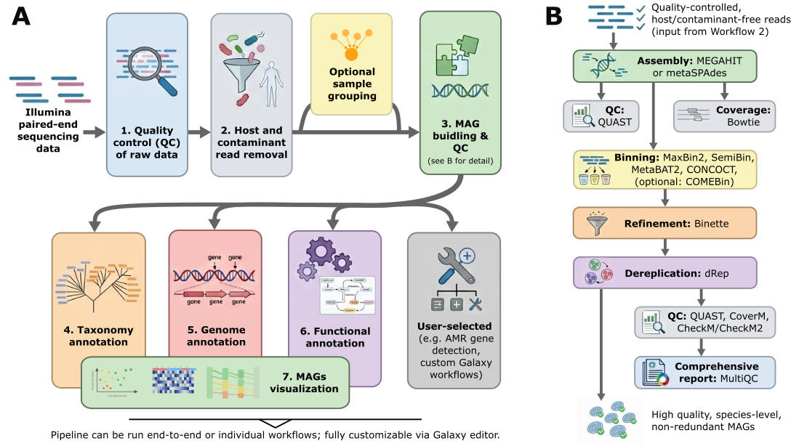

# FAIRyMAGs

**A FAIR Galaxy Metagenome-Assembled Genomes (MAGs) Workflow**



## Introduction

This repository provides a step-by-step guide for generating high-quality metagenome-assembled genomes (MAGs) using Galaxy.

The workflows can be executed on any major Galaxy server, including usegalaxy.eu, usegalaxy.org, usegalaxy.org.au, and usegalaxy.fr. Simply import the workflows from their IWC page and run them with your own data. The default parameters provide a good starting point and have been shown to recover high-quality MAGs across diverse metagenomic datasets, with performance comparable to leading approaches in the CAMI benchmark. Nevertheless, we recommend carefully reviewing the results of the quality control and host decontamination steps before proceeding to subsequent workflows to ensure that trimming and filtering parameters are appropriate for your dataset.

The workflows support both paired-end short-read metagenomes and the optional inclusion of long-read shotgun sequencing data. At present, the short-read workflow is the most thoroughly validated. Long-read support is available through version 5 of the main workflow but has not yet been evaluated as extensively.

This repository also includes the scripts and step-by-step instructions required to reproduce all analyses presented in the accompanying manuscript. This includes: the notebook to generate the plots for the [comparison of different MAGs workflows](bin/README.md) as well as the plots to [visualize the 4 investigated use cases](bin/README.md).

The workflows were developed by the [FAIRyMAGs project](https://elixir-europe.org/how-we-work/scientific-programme/science/bfsp/fairymags) under the [ELIXIR Scientific Programme 2024–28](https://elixir-europe.org/how-we-work/scientific-programme).

---

## Project Deliverables

1. [Workflow available on UseGalaxy Europe and UseGalaxy France servers](https://zenodo.org/records/20490822)
2. [Tutorial hosted on the Galaxy Training Network and visible on ELIXIR's TeSS](https://zenodo.org/records/20491034)
3. [Blogpost summarising the hackathon outcomes](https://zenodo.org/records/20491762)
4. [Prototype and metadata of Galaxy workflow](https://zenodo.org/records/20492418)
5. [Recovered MAGs for selection of three real-world datasets](https://zenodo.org/records/20492676)
6. [Data from MGnify with computational resources used for metagenomics assembly](https://zenodo.org/records/20492964)
7. [Hackathon in Freiburg](https://zenodo.org/records/20493091)
8. [Blog post: Exploring Microbial Dark Matter: Outcomes of the FAIRyMAGs Hackathon](https://galaxyproject.org/news/2025-10-21-fairymags-hackathon-outcome)
9. [FAIRyMAGs Hybrid Hackathon 2025: Event overview and objectives](https://galaxyproject.org/events/2025-10-06-fairy-mags-hackathon)
10. [Training material: Galaxy Training Network: Metagenome-Assembled Genomes (MAGs)](https://galaxyproject.github.io/training-material/learning-pathways/mags.html)
11. [Preprint: Machine learning-based prediction of memory requirements for metagenomics assembly](https://doi.org/10.64898/2026.05.12.724571)

---

## Project Members

* Paul Zierep (Project lead) - University of Freiburg, ELIXIR Germany
* Bérénice Batut (Project lead) - LMGE, Université Clermont Auvergne / IFB, ELIXIR France
* Martin Beracochea - EMBL-EBI, EMBL-EBI
* Santiago Sanchez Fragoso - EMBL-EBI, EMBL-EBI
* Giuseppe Defazio - University of Bari Aldo Moro, ELIXIR Italy
* Bruno Fosso - University of Bari Aldo Moro, ELIXIR Italy

## Step-by-step MAGs Generation Guideline

### Input

* Paired short reads (e.g., [Zenodo dataset](https://zenodo.org/records/15089018))

---

### Main Workflows and Tools

1. **Upload your data to Galaxy**

   * [Galaxy data upload guide](https://training.galaxyproject.org/training-material/faqs/galaxy/#data%20upload)
   * *Note:* Only [usegalaxy.eu](https://usegalaxy.eu) currently supports all tools and databases.
   * Optionally, use dedicated fetch tools for published data: [SRA fastq_dump](https://usegalaxy.eu/root?tool_id=toolshed.g2.bx.psu.edu/repos/iuc/sra_tools/fastq_dump/3.1.1+galaxy1)

2. **Group your data**

   * Create a [paired collection](https://training.galaxyproject.org/training-material/faqs/galaxy/collections_build_list_paired.html)

3. **Run quality control (QC) workflow**

   * [QC workflow](https://iwc.galaxyproject.org/workflow/short-read-qc-trimming-main/)

4. **Optional: Remove host contamination**

   * [Host contamination removal workflow](https://iwc.galaxyproject.org/workflow/host-contamination-removal-short-reads-main/)

5. **Optional: Group reads for co/grouped assembly**

   * [Read grouping tool](https://usegalaxy.eu/?tool_id=toolshed.g2.bx.psu.edu%2Frepos%2Fiuc%2Ffastq_groupmerge%2Ffastq_groupmerge%2F1.0.2%2Bgalaxy0&version=latest)

6. **Run MAGs generation workflow**

   * [MAGs-building workflow](https://iwc.galaxyproject.org/workflow/mags-building-main/)

---

### Potential Downstream Tools or Workflows

#### MAGs Annotation

* [Taxonomy annotation](https://iwc.galaxyproject.org/workflow/mags-taxonomy-annotation-main/)
* [AMR gene detection](https://iwc.galaxyproject.org/workflow/amr_gene_detection-main/)
* [Bacterial genome annotation](https://iwc.galaxyproject.org/workflow/bacterial_genome_annotation-main/)
* [Functional annotation of protein sequences](https://iwc.galaxyproject.org/workflow/functional-annotation-protein-sequences-main)

#### Differential Abundance Analysis

* [MaAsLin 2 Differential Analysis](https://usegalaxy.eu/?tool_id=toolshed.g2.bx.psu.edu%2Frepos%2Fiuc%2Fmaaslin2%2Fmaaslin2%2F1.18.0%2Bgalaxy0&version=latest)
* [MaAsLin 3 Differential Analysis](https://usegalaxy.eu/?tool_id=toolshed.g2.bx.psu.edu%2Frepos%2Fiuc%2Fmaaslin3%2Fmaaslin3%2F0.99.16%2Bgalaxy0&version=latest)

---

## Reproduce Analyses

### Requirements

This project uses Python 3 and the packages listed in [`requirements.txt`](requirements.txt).

Install in a conda environment:

1. **Install conda**

   * [Conda installation guide](https://docs.conda.io/projects/conda/en/latest/user-guide/install/index.html)

2. **Install dependencies**

   ```bash
   conda create -n fairymags -c conda-forge -c bioconda --file requirements.txt -y
   conda activate fairymags
   ```

3. **Add Galaxy API key**

   Add the API key to `.env` like `GALAXY_API=<key>`

---

### Benchmarking

* Follow the step-by-step guide in the [bin/README.md](bin/README.md)

### Use cases

* Follow the step-by-step guide in the [bin/README.md](bin/README.md)
