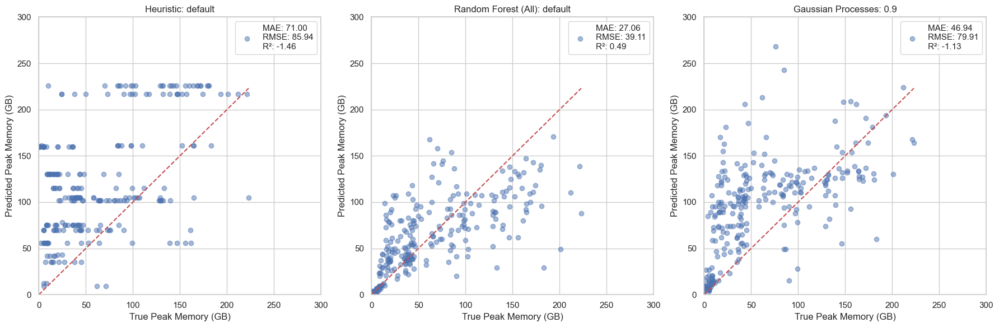
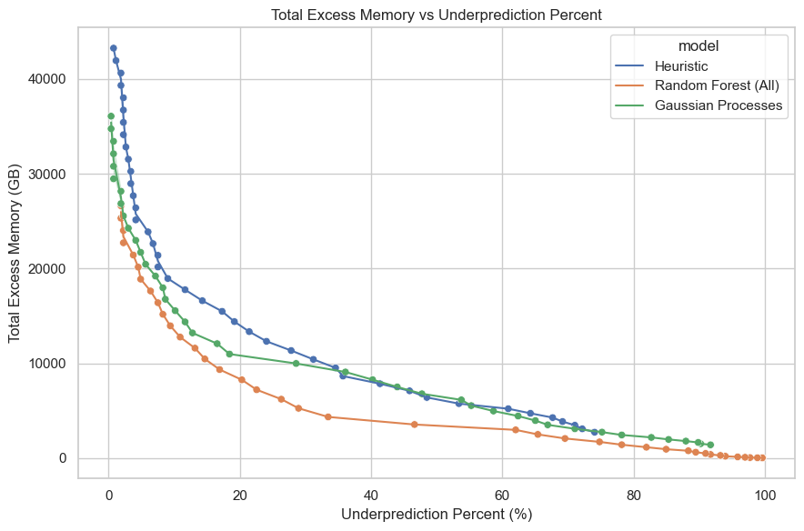
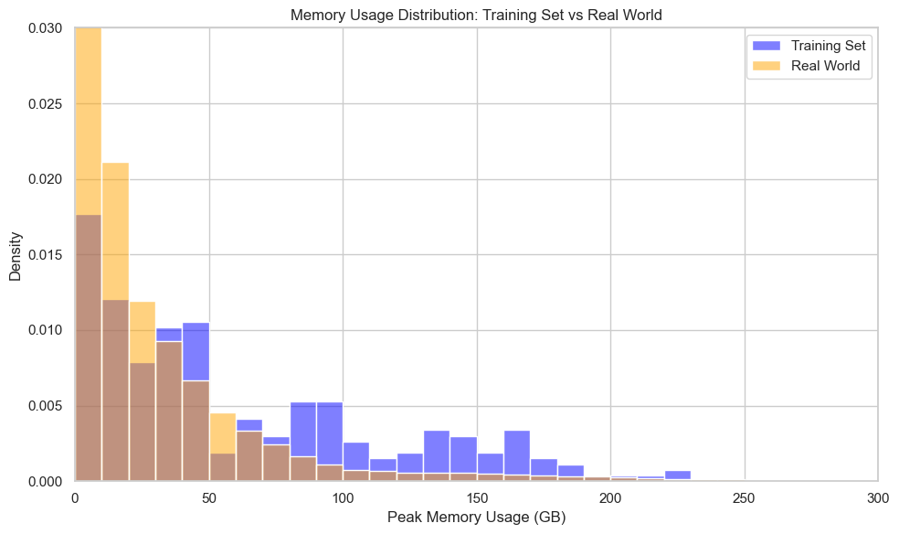
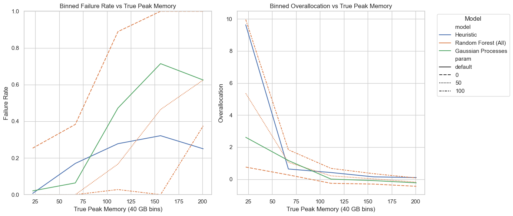
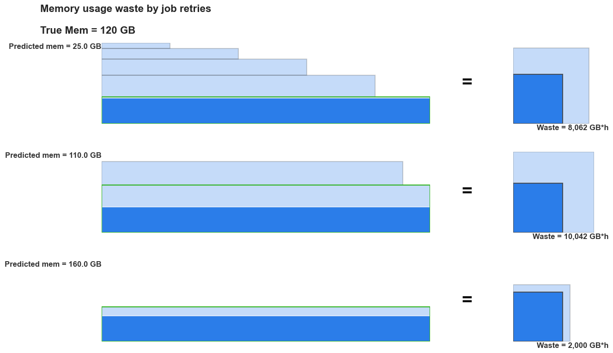
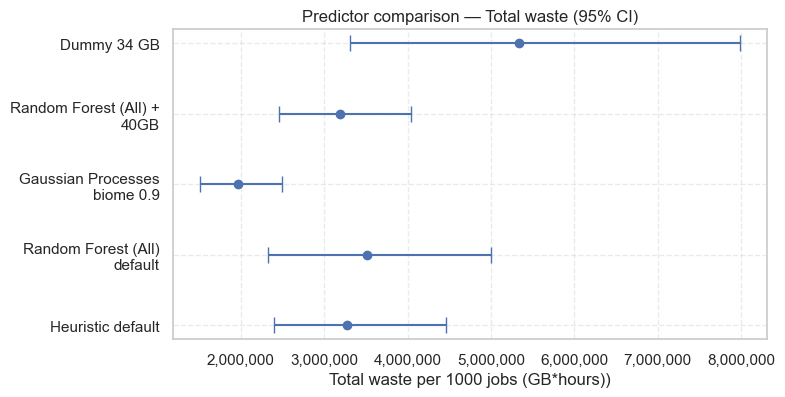
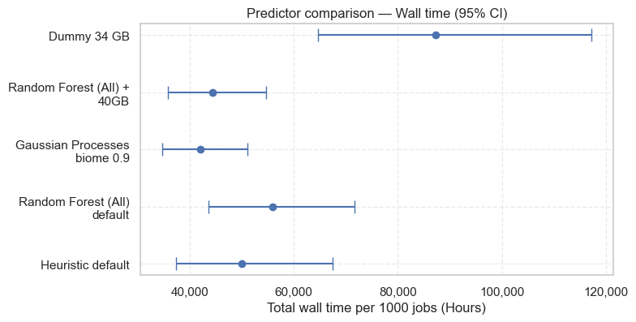
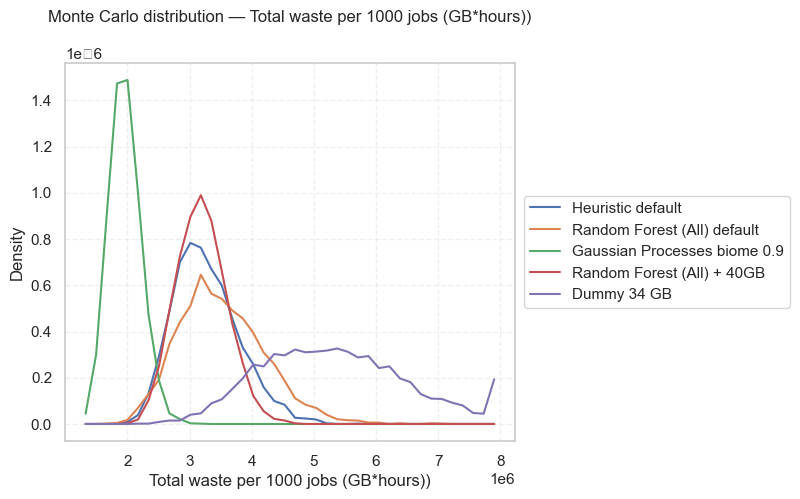
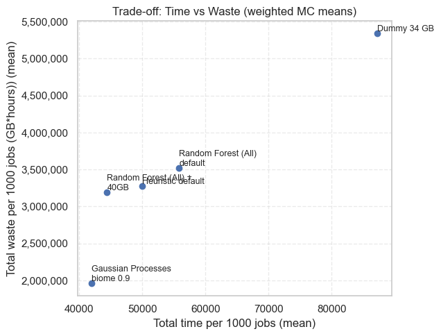

# Evaluating resource allocation models for assembly HPC jobs

Accurately predicting resource use is essential in shared HPC systems. When memory estimates are off, throughput of a pipeline is limited or results in waste resources. Choosing the right model requires evaluation methods that reflect how systems actually run.

From a user’s view, a failed job means lost time and job caring. From an HPC administrator’s view, it means resource duplication when the system retries. Both translate into wasted compute.

In this analysis, we tested several models and evaluation metrics to understand which approach best supports real-world HPC workloads.

---

## Standard metrics tell only part of the story

We started with the usual indicators — MAE, RMSE, and R² — and included a safety/efficiency trade-off metric.

At first, the Random Forest model looked best. It achieved the lowest error and offered a good balance between under- and over-prediction.

    

    

    

    

---

## Real workloads look different from the evaluation set

When we compared the memory usage patterns of real jobs with our evaluation dataset, we saw a major mismatch.

Production jobs were smaller and more varied, while the evaluation data contained many large jobs.

This difference matters. Standard metrics assume both sets are similar. In reality, that assumption biases results toward models that perform well on large jobs — even if they fail more often in real operations.

    

    

## Plots showing bins of mem vs underprediction failure rate

    

    

Further analysis showed that all models struggled with high-memory jobs.

Underestimation led to failed jobs, while overestimation wasted memory on smaller ones.

---

## Rethinking what “good” looks like

A better evaluation should reflect the true cost per job, not just error magnitude between the prediction and the true peak memory.

That cost includes wasted allocations, retry attempts, and the duaration of asked allocations.

Considering these factors, we defined a cost function:
$$
C(y; a_0) = 
\underbrace{\sum_{r=0}^{R-1} C_{\text{fail}}(y, a_r)}_{\text{cost of retries}} 
+ 
\underbrace{C_{\text{over}}(y, a_R)}_{\text{waste on the successful attempt}}
$$
Where:
\[
\begin{aligned}
y &:\ \text{true peak memory use} \\
a_0 &:\ \text{initial memory allocation} \\
a_r &:\ \text{allocation on retry } r \\
R &:\ \text{total number of retries until success} \\
a_R &:\ \text{allocation on successful attempt} \\
C_{\text{fail}}(y, a_r) &:\ \text{cost incurred when a job fails due to under-allocation} \\
C_{\text{over}}(y, a_R) &:\ \text{cost incurred from over-allocation on the successful attempt}
\end{aligned}
\]

Using this function we can simulate the total cost of running jobs under different prediction models and allocation strategies.

For example, a model that underpredicts slightly might cause multiple retries — each consuming more total resources than a single, slightly overpredicted allocation.

**High accuracy of peak memory prediction doesn’t guarantee lower waste**.

We visualise this effect when a job’s true memory use is 120 GB, different starting allocations lead to very different total resource costs. Small prediction errors can multiply into large operational waste.

__Figure:__ Illustration of job memory usage over time.  
Each bar shows a single job attempt, where **height** represents memory usage and **width** represents wall time.  
The **total shaded area** corresponds to the overall resource cost until the job completes successfully. **Dark blue** indicates true memory used, while **light blue** shows wasted allocation.

    /tmp/ipykernel_1226469/3462535538.py:90: UserWarning: This figure includes Axes that are not compatible with tight_layout, so results might be incorrect.
      plt.tight_layout(rect=(0, 0, 1, 0.98))

    

    

---

## What the results show

When we compared all models using cost-based metrics—total memory usage waste, total wall time, and failure rate —based on real production distribution, the results changed.

    

    

    

    

    

    

    

    

Despite its strong MAE and R², the Random Forest model did not outperform the current heuristic in total waste.

However, integrating biome as feature (Gaussian Processes) showed promising results.

---

## What this means for us

If we continue to rely on traditional metrics, we risk selecting models that look good in tests but cost more in production.

Model evaluation must account for how jobs are distributed and how systems recover from errors.

By incorporating real workload distributions, memory-time usage, and retry costs, we can design metrics that reward what truly matters: fewer failures and lower total waste.

Message to take away: Re-evaluate model selection under these realistic conditions.

## Next steps

- Collect more real job data to better represent actual workloads.
- Include failed job logs to improve model training.
- Define and test cost-aware evaluation metrics that combine accuracy, retry behavior, and operational efficiency. This could also help with training loss functions.
- Explore adaptive allocation strategies that adjust based on past job performance.
- Better metrics mean better models — and better use of HPC systems.
