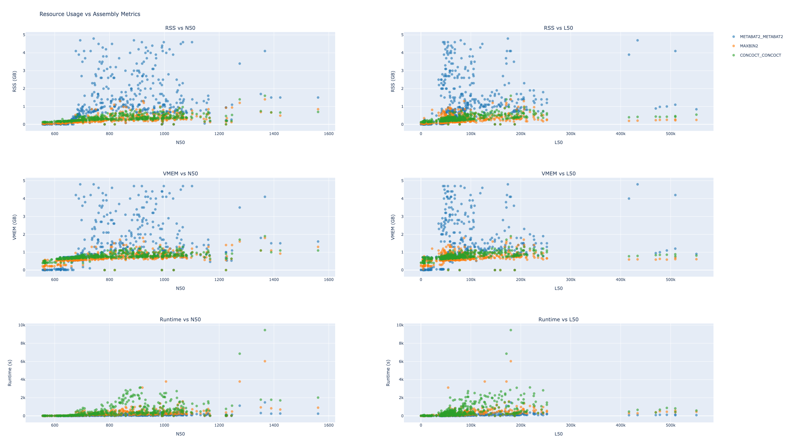

# Mgnify GGP pipelne binner resource usage

This file contains cleaned and processed execution trace data used for resource usage plots.

The csv file only contains the resource usage for the binners used in https://github.com/EBI-Metagenomics/genomes-generation - MAXBIN2, CONCOCT (named: CONCOCT_CONCOCT) and METABAT2 (named: METABAT2_METABAT2).

The file [binner_resources](binner_resources.csv)

## Exporatory

## Columns

This file contains loads of info, some of it may not be super useful.

### Nextflow Execution Metadata
- `task_id`: Unique identifier for the task
- `hash`: Task hash value
- `native_id`: Native executor job ID
- `name`: Task name
- `status`: Execution status (COMPLETED, FAILED, etc.)
- `exit`: Exit code
- `submit`: Submission timestamp
- `duration`: Total task duration

### Resource Usage (Raw)
- `realtime`: Actual execution time
- `%cpu`: CPU usage percentage
- `peak_rss`: Peak resident set size (memory)
- `peak_vmem`: Peak virtual memory
- `rchar`: Characters read
- `wchar`: Characters written

### Resource Usage (Converted)
- `peak_rss_gb`: Peak RSS in gigabytes
- `peak_vmem_gb`: Peak virtual memory in gigabytes
- `cpu_percent`: CPU usage as percentage
- `realtime_seconds`: Realtime in seconds

### Sample/Process Information
- `sample_id`: Sample identifier
- `process_name`: Nextflow process name
- `source_file`: Source workflow file
- `assembly_accession`: Assembly accession number
- `run_accession`: Run accession number

### Assembly Quality Metrics (QUAST)
- `# N's per 100 kbp`: Assembly gap density
- `# contigs (>= X bp)`: Contig counts at various size thresholds (0, 1000, 5000, 10000, 25000, 50000)
- `Assembly`: Assembly name/identifier
- `GC (%)`: GC content percentage
- `L50`: Number of contigs comprising 50% of assembly
- `L90`: Number of contigs comprising 90% of assembly
- `Largest contig`: Size of largest contig
- `N50`: Contig length at 50% of total assembly length
- `N90`: Contig length at 90% of total assembly length
- `Total length (>= X bp)`: Total assembly length at various contig size thresholds
- `auN`: Area under the Nx curve (assembly contiguity metric)